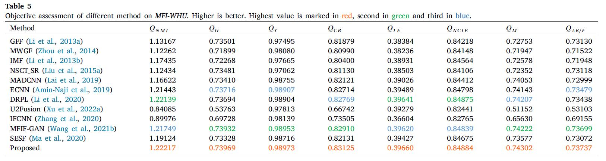

## Official implementation of multi-focus image fusion with interactive transformer

<div align="center">
  
</div>

<div align="center">
  
</div>

[//]: # (<div align="center">)

[//]: # (  )

[//]: # (</div>)

<div align="center">
  
</div>

[//]: # (<div align="center">)

[//]: # (  )

[//]: # (</div>)

<div align="center">
  
</div>

<div align="center">
  
</div>

If you benefit from this project, please consider citing our [paper](https://www.sciencedirect.com/science/article/abs/pii/S0952197624001258)

```
@article{zhai2024multi,
  title={Multi-focus image fusion via interactive transformer and asymmetric soft sharing},
  author={Zhai, Hao and Zheng, Wenyi and Ouyang, Yuncan and Pan, Xin and Zhang, Wanli},
  journal={Engineering Applications of Artificial Intelligence},
  volume={133},
  pages={107967},
  year={2024},
  publisher={Elsevier}
}
```
